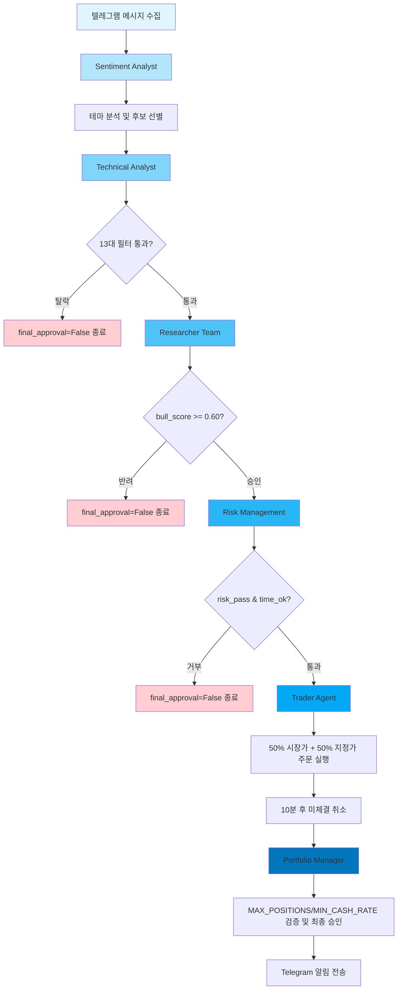

# JY 투자클럽 에이전트 흐름 다이어그램

이 문서는 `docs/README_AGENT.md`에 정의된 멀티-에이전트 팀 구조를 기반으로 한 실제 흐름 다이어그램과 코드 구조를 설명합니다.

## 에이전트 흐름 다이어그램

아래는 Mermaid 형식의 다이어그램으로, 텔레그램 테마 신호부터 최종 매매 실행까지의 에이전트 간 상호작용을 보여줍니다.



### 다이어그램 설명

- **Sentiment Analyst**: 텔레그램 데이터를 분석해 초기 테마 후보를 생성합니다.
- **Technical Analyst**: `analyzer.py`의 필터로 기술적 유효성을 검증합니다.
- **Researcher Team**: Bull/Bear 관점으로 재평가하며, 리스크를 강조합니다.
- **Risk Management**: 실시간 모니터링으로 안전성을 보장합니다.
- **Trader Agent**: `trader.py`에서 주문을 실행합니다.
- **Portfolio Manager**: 최종 정책 적용 (현재는 Trader Agent에 통합 가능).

## 코드 구조 제안

각 에이전트를 클래스로 구현하여 모듈화합니다. `agents/` 폴더에 배치합니다.

### 1. Base Agent 클래스 (`agents/base_agent.py`)

```python
from abc import ABC, abstractmethod

class BaseAgent(ABC):
    def __init__(self, name: str):
        self.name = name

    @abstractmethod
    def process(self, input_data: dict) -> dict:
        pass
```

### 2. Sentiment Analyst (`agents/sentiment_analyst.py`)

```python
from agents.base_agent import BaseAgent
import theme_db

class SentimentAnalyst(BaseAgent):
    def __init__(self):
        super().__init__("Sentiment Analyst")

    def process(self, input_data: dict) -> dict:
        # 텔레그램 메시지 분석 및 테마 추출
        themes = theme_db.get_themes_for_code(input_data.get("stock_code", ""))
        return {"themes": themes, "sentiment_score": 0.8}  # 예시
```

### 3. Technical Analyst (`agents/technical_analyst.py`)

```python
from agents.base_agent import BaseAgent
import analyzer

class TechnicalAnalyst(BaseAgent):
    def __init__(self):
        super().__init__("Technical Analyst")

    def process(self, input_data: dict) -> dict:
        # 13대 필터 검증
        result = analyzer.is_valid_stock_final(
            stock=input_data["stock"],
            open_price=input_data["open_price"],
            high_price=input_data["high_price"],
            prev_close=input_data["prev_close"],
            daily_prices=input_data["daily_prices"],
            daily_opens=input_data["daily_opens"],
            daily_closes=input_data["daily_closes"],
            daily_volumes=input_data["daily_volumes"],
            minute_vols=input_data["minute_vols"],
            user=input_data["user"],
            token=input_data["token"]
        )
        return result
```

### 4. Researcher Team (`agents/researcher_team.py`)

```python
from agents.base_agent import BaseAgent

class ResearcherTeam(BaseAgent):
    def __init__(self):
        super().__init__("Researcher Team")

    def process(self, input_data: dict) -> dict:
        # Bull/Bear 토론 시뮬레이션 (간단한 규칙 기반)
        bull_score = input_data.get("technical_pass", False) and input_data.get("sentiment_score", 0) > 0.7
        bear_score = input_data.get("vi_safe", True) and input_data.get("market_bullish", True)
        return {"bull_approved": bull_score, "bear_approved": bear_score, "final_decision": bull_score and bear_score}
```

### 5. Risk Management (`agents/risk_management.py`)

```python
from agents.base_agent import BaseAgent
import analyzer

class RiskManagement(BaseAgent):
    def __init__(self):
        super().__init__("Risk Management")

    def process(self, input_data: dict) -> dict:
        # 리스크 체크
        time_ok = analyzer.is_valid_trading_time()["ok"]
        market_ok = input_data.get("market_bullish", False)
        return {"risk_pass": time_ok and market_ok}
```

### 6. Trader Agent (`agents/trader_agent.py`)

```python
from agents.base_agent import BaseAgent
import trader

class TraderAgent(BaseAgent):
    def __init__(self):
        super().__init__("Trader Agent")

    def process(self, input_data: dict) -> dict:
        # 주문 실행
        result = trader.execute_split_buy(
            user=input_data["user"],
            stock_code=input_data["stock"]["code"],
            current_price=input_data["stock"]["price"]
        )
        return {"trade_result": result}
```

### 7. Portfolio Manager (`agents/portfolio_manager.py`)

```python
from agents.base_agent import BaseAgent
import config, position_tracker

class PortfolioManager(BaseAgent):
    def process(self, input_data: dict) -> dict:
        trade_result = input_data.get("trade_result")
        if not trade_result:
            return {"final_approval": False, "portfolio_reason": "주문 미체결"}

        account_no = input_data.get("user", {}).get("account_no", "")
        budget = input_data.get("user", {}).get("budget", 1)
        positions = position_tracker.get_open_positions()
        position_count = sum(1 for p in positions if p["account_no"] == account_no)
        invested = sum(p["buy_price"] * p["qty"] for p in positions if p["account_no"] == account_no)
        cash_rate = max(0.0, 1 - invested / budget)

        if position_count > config.MAX_POSITIONS:
            logger.warning(f"[Portfolio] MAX_POSITIONS 초과: {position_count}/{config.MAX_POSITIONS}")
        if cash_rate < config.MIN_CASH_RATE:
            logger.warning(f"[Portfolio] 현금 비율 부족: {cash_rate:.1%} < {config.MIN_CASH_RATE:.1%}")

        return {"final_approval": True, "position_count": position_count, "cash_rate": round(cash_rate, 4)}
```

### 통합 실행 — 게이트 로직 (`agents/agent_orchestrator.py`)

`run_flow()`는 각 에이전트 결과를 누적하며, 탈락 조건 충족 시 즉시 `break`합니다.

```python
for name in ("sentiment", "technical", "researcher", "risk", "trader", "portfolio"):
    result = self.agents[name].process(accumulated)
    accumulated.update(result)

    if name == "technical" and not accumulated.get("pass", True):
        accumulated["final_approval"] = False
        break
    if name == "researcher" and not accumulated.get("final_decision", False):
        accumulated["final_approval"] = False
        break
    if name == "risk" and not accumulated.get("risk_pass", True):
        accumulated["final_approval"] = False
        break
```

이 구조를 `agents/` 폴더에 구현하면, 각 에이전트가 독립적으로 작동하며 확장 가능합니다. 필요 시 실제 LLM 통합으로 업그레이드할 수 있습니다.
